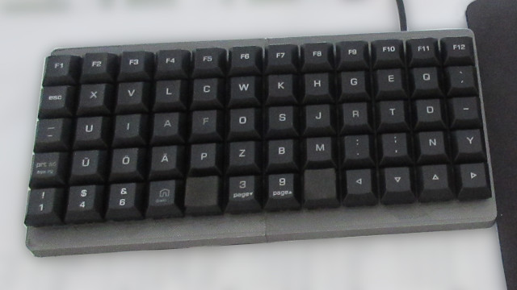

# 12x5 keyboard

CAD file and keymap for an 12x5 keyboard with [qmk firmware](https://qmk.fm/).

This is a hand wired keyboard. It uses the Cherry MX keyswitches and a Teensy 2.0 for the controller board.
The physical layout is a slightly modified version of the [Neo2 layout](https://neo-layout.org/), but the
keyboard can be used with the computer set to the german keyboard layout because the controller converts
the key presses to match the keycodes generated by a standard keyboard.
That makes it possible to use a Neo2 layout on computers that do not support it.

## How to build the firmware
* download the qmk firmware
* copy the "12x5" folder in the keyboards folder
* follow the instructions [here](https://docs.qmk.fm/#/newbs_building_firmware?id=build-your-firmware)
